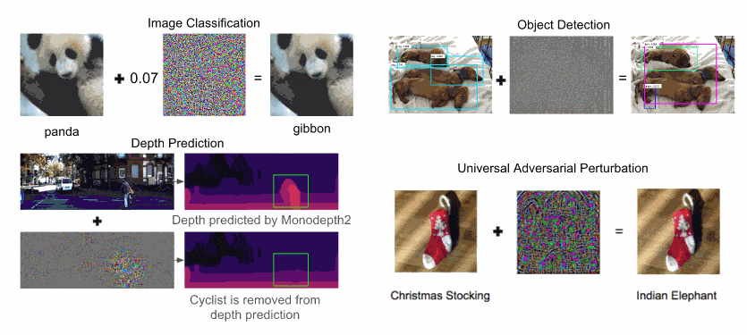
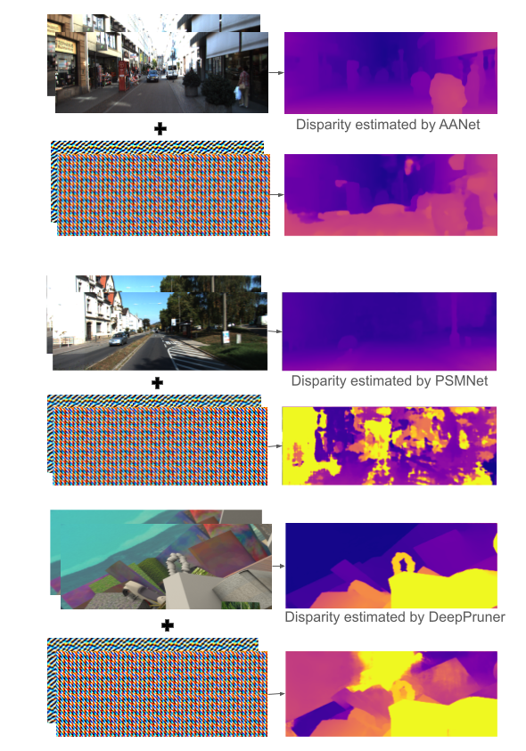
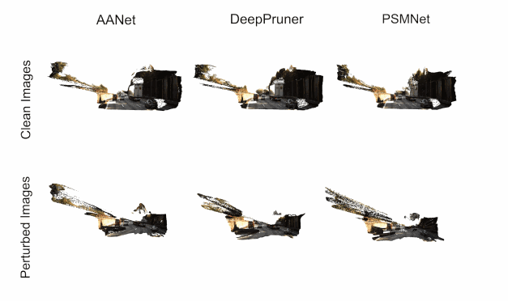
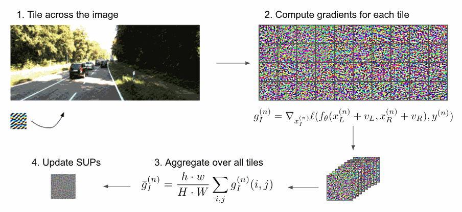
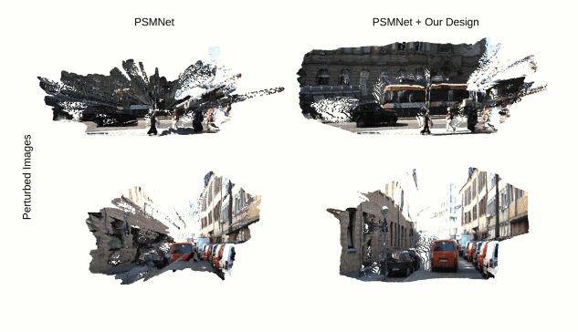
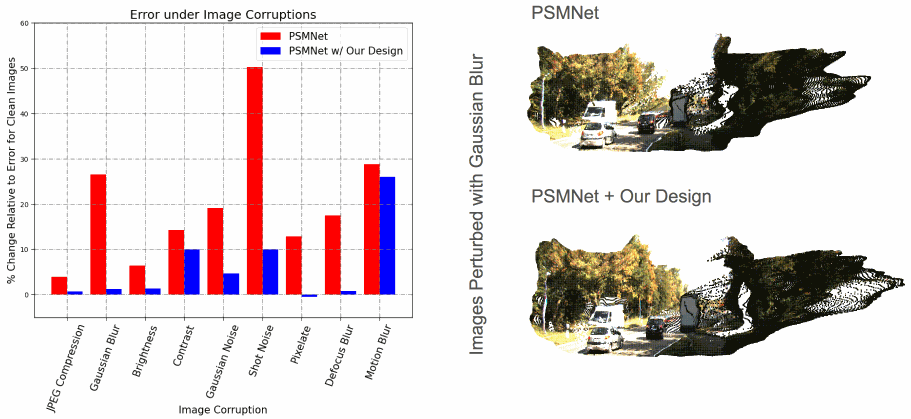

# Stereoscopic Universal Perturbations across Different Architectures and Datasets

PyTorch Implementation of *Stereoscopic Universal Perturbations across Different Architectures and Datasets*

Published in CVPR 2022

[[publication]](https://openaccess.thecvf.com/content/CVPR2022/papers/Berger_Stereoscopic_Universal_Perturbations_Across_Different_Architectures_and_Datasets_CVPR_2022_paper.pdf) [[arxiv]](https://arxiv.org/abs/2112.06116.pdf) [[poster]]() [[talk]](https://www.youtube.com/watch?v=_TUKqQ64iQE)

Authors: [Parth Agrawal](https://agrawalparth10.github.io), Zackery Berger, Tian Yu Liu, [Alex Wong](http://web.cs.ucla.edu/~alexw/)

Code has been tested on Ubuntu 16.04, 20.04 using Python 3.7, 3.8, PyTorch 1.2, 1.3, 1.7.1 (CUDA 10.1)

If this work is useful to you, please cite our paper:
```
@inproceedings{berger2022stereoscopic,
  title={Stereoscopic Universal Perturbations across Different Architectures and Datasets},
  author={Berger, Zachary and Agrawal, Parth and Liu, Tian Yu and Soatto, Stefano and Wong, Alex},
  booktitle={Proceedings of the IEEE/CVF Conference on Computer Vision and Pattern Recognition},
  pages={15180--15190},
  year={2022}
}
```

**Table of Contents**
1. [About Adversarial Perturbations](#about-adversarial-perturbations)
2. [About Stereopagnosia](#about-stereopagnosia)
3. [About Stereoscopic Universal Perturbations (SUPs)](#about-sups)
4. [About Optimizing SUPs](#optimizing-sups)
5. [Towards Robustness against SUPs](#robustness-sups)
6. [Setting up your virtual environment](#setting-up-virtenv)
7. [Setting up your datasets](#setting-up-datasets)
8. [Setting up pretrained stereo models](#setting-up-external-models)
9. [Setting up pretrained SUPs](#setting-up-perturbations)
10. [Running pretrained SUPs](#running-sups)
11. [Training SUPs](#training-sups)
12. [Training stereo models with deformable convolutions](#training-deform-models)
13. [Related projects](#related-projects)
14. [License and disclaimer](#license-disclaimer)

## About Adversarial Perturbations <a name="about-adversarial-perturbations"></a>
Adversarial perturbations are small signals that, when added to images, are visually imperceptible yet can cause the output of a deep neural network to change dramatically. They have been studied extensively for single-image-based tasks such as classification, detection, segmentation, and depth prediction. For example, we know that a deep network can be fooled to misclassify a panda as a gibbon, incorrectly detect a dog as a train, or a person, or even remove a biker from the 3D scene (see below).

However, these perturbations are optimized for a specific single image, and network trained on a specific dataset and so they typically do not transfer across networks or datasets. Universal adversarial perturbations not only affect a single image, but multiple images or even an entire dataset - though they are typically universal to each image in a particular dataset, and usually do not extend to different datasets. The same perturbation can cause a camel to be predicted as a sloth and a stocking to be predicted as an elephant:

<p align="center">
    
</p>

This is not too surprising because there exists no unique minimizer for a single image. In other words, a single image does not constraint the latent or output of a network, the training set does. To infer the class or depth of an image, the network must rely on “transferring” prior knowledge from different scenes other than the one in question.

## About Stereopagnosia <a name="about-stereopagnosia"></a>
This is not true for stereo where one is given a pair of images taken by stereo cameras that are typically situated side by side separated by a fixed distance that we call the baseline. Binocular disparity is sufficient to uniquely infer depth anywhere in the image where there are sufficiently exciting textures. So there is no need for induction, training, or even a dataset to estimate depth. But it turns out that even when the output can be uniquely inferred like calibrated stereo, the deep neural network can just as easily be fooled. We call this phenomenon **Stereopagnosia**. For example, a pair of perturbation images can be optimized to introduce gross errors in the output of deep stereo matching networks as shown in these figures. However, the pair of perturbation images only works for a specific neural network, for a specific stereo pair from a specific dataset. Since individual perturbations had to be crafted for each image, security concerns were far-fetched. But one may wonder if there exists a single perturbation image that transfers across multiple datasets, across multiple domains that affects multiple network architectures trained in different ways. As stereo is common in robotics and autonomy, can such perturbations present a concern, if so, can we leverage them to render deep neural networks more robust?

## About Stereoscopic Universal Perturbations (SUPs)  <a name="about-sups"></a>
In this work, we show the existence of universal adversarial perturbations for deep stereo networks that we term Stereoscopic Universal Perturbations or SUPs. A single set of additive perturbations can be applied effectively to corrupt the disparity estimates of multiple deep stereo networks on different stereo pairs even without knowledge of the architectures or the way they are trained.

<p align="center">
    
</p>

<p align="center">
    
</p>

## About Optimizing SUPs <a name="optimizing-sups"></a>

<p align="center">
    
</p>

Typically, perturbations are optimized across the entire image. Unlike them, SUPs are generally a patch that is much smaller in dimensions and are applied to a given clean image by evenly repeating or tiling without overlap across the image height and width to yield a perturbed image. To optimize SUPs, we maximize the difference between the outputs of the network for clean and perturbed stereo pairs and compute the gradient of the loss w.r.t. the clean images. The gradients across all patches are averaged, and projected onto a $\ell$<sub>$\infty$</sub> ball of radius &alpha;, which serves as a learning rate, and is used to update the perturbations. By introducing this tiling scheme, we prevent the perturbations from overfitting to the bias in the images induced by the training set, for instance having roads at bottom of the image and sky at the top for outdoor driving. This helps with generalization across images, datasets, and even domains. These steps are repeated iteratively for every sample within a training set. To constrain aggregated perturbations to a specific upper norm so that they remain quasi imperceptible, the perturbations are projected onto $\ell$<sub>$\infty$</sub> ball of $\epsilon$ radius at every step.


## Towards Robustness against SUPs <a name="robustness-sups"></a>

<p align="center">
    
</p>

We found out that replacing convolutional layers with deformable convolutions can boost the robustness of the network against SUPs. We conjecture that this is because deformable convolutions predict convolutional offsets based on the input which in turn allows them to “avoid” the adversarial signal. Additionally, we also found that network architectures employing explicit matching modules like PatchMatch or correlation tend to exhibit higher robustness. By redesigning PSMNet with deformable convolutions and explicit matching, improved its robustness by 63%, which rivals the robustness of networks fine-tuned with the widely used adversarial data augmentation. Better yet, our design can be used in conjunction with adversarial fine-tuning to achieve even more robust networks.

<p align="center">
    
</p>

Not only does our design mitigate the adversarial effect, they also improve the robustness against common image perturbations that may arise from various corruptions like blurring, shot noise, image compression by an average of 70%.


## Setting up your virtual environment <a name="setting-up-virtenv"></a>
We will create a virtual environment with the necessary dependencies.

For Nvidia GTX 10 series (CUDA 10.1)
```
virtualenv -p /usr/bin/python3.7 sups-py37env
source sups-py37env/bin/activate
pip install -r requirements.txt
```

## Setting up your datasets <a name="setting-up-datasets"></a>
For datasets, we will use [KITTI raw][kitti_dataset], [KITTI 2012][kitti2012_dataset], [KITTI 2015][kitti2015_dataset], and FlyingThings3D (disparity, clean and final pass images) from [Scene Flow][sceneflow dataset] datasets.
```
mkdir data
mkdir data/scene_flow_datasets
ln -s /path/to/kitti_raw_data data/kitti_raw_data
ln -s /path/to/kitti_scene_flow data/kitti_scene_flow
ln -s /path/to/kitti_stereo_flow data/kitti_stereo_flow
ln -s /path/to/flyingthings3d data/scene_flow_datasets/flyingthings3d
```

Run the following commands to set up the paths to KITTI raw, KITTI 2012, KITTI 2015, and FlyingThings3D datasets:
```
python setup/setup_dataset_kitti.py
python setup/setup_dataset_kitti_segmentation.py
python setup/setup_dataset_flyingthings3d.py
```
This will produce `training`, `validation` and `testing` directories containing text files with paths to the data.

## Setting up pretrained stereo models <a name="setting-up-external-models"></a>
We will be using PSMNet, DeepPruner and AANet. Their code have already been prepackaged into the `external_src` directory.
Run the following commands to set up and download their pretrained weights:
```
python setup/setup_model_psmnet.py
python setup/setup_model_deeppruner.py
python setup/setup_model_aanet.py
python tools/test_stereo_models.py
```
This will download pretrained weights to `pretrained_models` and test them. You should expect the message:
```
Passed tests for stereo models
```
We have precompiled the binaries for deformable convolutions used in AANet, see
```
external_src/aanet/nets/deform_conv/
```
If you experience problems with the binaries, you may also compile them yourselves using:
```
cd external_src/aanet/nets/deform_conv
bash build.sh
```
We included instructions provided by the authors in `external_src/aanet/README.md`.

Note that PSMNet weights trained on Scene Flow has been retrained because those released by the authors do not reproduce their results on the FlyingThings3D dataset.

## Setting up pretrained SUPs <a name="setting-up-perturbations"></a>
The script will store all the pretrained perturbations in the `pretrained_perturbations` directory. Inside the directory, the perturbations are separated based on the model they were trained on and the properties of the perturbation.
```
python setup/setup_model_sups.py
```

## Running pretrained SUPs <a name="running-sups"></a>
To evaluate the SUPs on KITTI 2015 dataset for different model architectures [`aanet, deeppruner, psmnet, psmnet_deform6, psmnet_deform25, psmnet_deform25_patchmatch`], execute the following command
```
bash bash/[MODEL NAME]/eval_perturb_kitti2015_[MODEL NAME].sh
```
with [MODEL NAME] replaced with one of the above architectures.

Here are a few examples to evaluate a SUP on AANet and PSMNet
```
bash bash/aanet/eval_perturb_kitti2015_aanet.sh
bash bash/psmnet/eval_perturb_kitti2015_psmnet.sh
```
The above commands should output the following results
```
Validation results @ step=9000:
Error w.r.t. clean images
             D1-Error          +/-         EPE         +/-
               54.6897     17.6426     15.2199      6.0153
Error w.r.t. ground truth
             D1-Error          +/-         EPE         +/-
               48.4298     16.8842     11.5661      4.7053

Validation results @ step=14000:
Error w.r.t. clean images
             D1-Error          +/-         EPE         +/-
               79.0464     13.8413     45.4722     15.5282
Error w.r.t. ground truth
             D1-Error          +/-         EPE         +/-
               87.7183     11.5573     41.3850     16.5999
```

To evaluate the SUPs on KITTI 2012 dataset for different model architectures [`aanet, deeppruner, psmnet, psmnet_deform6, psmnet_deform25, psmnet_deform25_patchmatch`], execute the following command
```
bash bash/[MODEL NAME]/eval_perturb_kitti2012_[MODEL NAME].sh
```
with [MODEL NAME] replaced with one of the above architectures.

Here is an example to evaluate a SUP on AANet
```
bash bash/aanet/eval_perturb_kitti2012_aanet.sh
```
The above command should output the following result
```
Validation results @ step=9000:
Error w.r.t. clean images
             D1-Error          +/-         EPE         +/-
               52.8231     13.1413     12.1441      5.0563
Error w.r.t. ground truth
             D1-Error          +/-         EPE         +/-
               58.0412     12.5103     13.0521      3.9954
```

To evaluate the SUPs on FlyingThings3D dataset for different model architectures [`aanet, deeppruner, psmnet, psmnet_deform6, psmnet_deform25, psmnet_deform25_patchmatch`], execute the following command
```
bash bash/[MODEL NAME]/eval_perturb_flyingthings3d_[MODEL NAME].sh
```
with [MODEL NAME] replaced with one of the above architectures.

Here is an example to evaluate a SUP on AANet
```
bash bash/aanet/eval_perturb_flyingthings3d_aanet.sh
```
The above command should output the following result
```
Validation results @ step=9000:
Error w.r.t. clean images
             D1-Error          +/-         EPE         +/-
               44.4966     13.2853      9.0646      5.0141
Error w.r.t. ground truth
             D1-Error          +/-         EPE         +/-
               46.1350     12.8868      9.4717      4.8831
```

To evaluate the transferability of SUPs across model architectures, set the `SUPS_DIRPATH` and `SUPS_FILENAME` to point to the SUP trained on a different model architecture.

For example, to evalute the transferability of a perturbation trained on AANet to PSMNet, change the `bash/psmnet/eval_perturb_kitti2015_psmnet.sh` from
```
SUPS_DIRPATH=pretrained_perturbations/psmnet/tile64_norm002
SUPS_FILENAME=sups_psmnet_tile64_norm002.pth
```
to
```
SUPS_DIRPATH=pretrained_perturbations/aanet/tile64_norm002
SUPS_FILENAME=sups_aanet_tile64_norm002.pth
```

Running the bash script after making the above change will output the following
```
Validation results @ step=9000:
Error w.r.t. clean images
             D1-Error          +/-         EPE         +/-
               58.0894     17.0790     21.7999      9.4910
Error w.r.t. ground truth
             D1-Error          +/-         EPE         +/-
               61.6551     14.3948     14.9704      6.4888
```

### Description of various parameters in the evaluation script
* The `attack` parameter can be set to either `tile` or `full`. By setting the `attack` parameter to `full`, the size of the SUP is set to the same size as the image. The `tile` can be used to optimize the SUP using the method of tiling as described above in the Optimizing SUP section.

* The `n_perturbation_height` and `n_perturbation_width` can be used to set the size of the perturbation when the `attack` parameter is set to `tile`.

* The `num_deform_layers` can be used to set the number of deformable conviolutions in the network architecture. Currently we only support `6` and `25` for `psmnet` and `25` for `deeppruner`.


## Training SUPs <a name="training-sups"></a>
To train SUPs with full size, run the following commands for different architectures [`aanet, deeppruner, psmnet, psmnet_deform6, psmnet_deform25, psmnet_deform25_patchmatch`]

```
bash bash/[MODEL NAME]/train_perturb_[MODEL NAME].sh
```
with [MODEL NAME] replaced with one of the above architectures.

To train SUPs using tiling, run the following commands for different architectures [`aanet, deeppruner, psmnet, psmnet_deform6, psmnet_deform25, psmnet_deform25_patchmatch`]. The tile size can be changed by setting the `n_perturbation_height` and `n_perturbation_width` in the bash script.
```
bash bash/[MODEL NAME]/train_perturb_tile_[MODEL NAME].sh
```

## Training stereo models with deformable convolutions <a name="training-deform-models"></a>
We provide training scripts to train PSMNet with 6 and 25 layers of deformable convolutions. Moreover, we also providing training script to train PSMNet with Patch Match (Deeppruner) and 25 layers of deformable convolutions.

To train PSMNet with deformable convolutions one needs to setup the data directory structure in a similar way as the [PSMNet Repository](https://github.com/JiaRenChang/PSMNet). Note, we have used finalpass instead of cleanpass for Sceneflow dataset.

For example `data/scene_flow_datasets` should look like the following

```
ln -s /path/to/driving/disparity data/scene_flow_datasets/driving_disparity
ln -s /path/to/driving/frames_finalpass data/scene_flow_datasets/driving_frames_finalpass

ln -s /path/to/flyingthings3d/disparity data/scene_flow_datasets/frames_disparity
ln -s /path/to/flyingthings3d/frames_finalpass data/scene_flow_datasets/frames_finalpass

ln -s /path/to/monkaa/disparity data/scene_flow_datasets/monkaa_disparity
ln -s /path/to/monkaa/frames_finalpass data/scene_flow_datasets/monkaa_frames_finalpass
```

Run the following command for training psmnet with 6 layers of deformable convolutions
```
bash bash/psmnet_deform6/train_psmnet_deform6.sh
```

Run the following command to train PSMNet with 25 layers of deformable convolutions
```
bash bash/psmnet_deform25/train_psmnet_deform25.sh
```

To train PSMNet with Patch Match and 25 layers of deformable convolutions, setup the data directory structure as mentioned in [DeepPruner Repository](https://github.com/uber-research/DeepPruner). Run the following command
```
bash bash/psmnet_deform25_patchmatch/train_psmnet_deform25_patchmatch.sh
```

## Finetuning stereo models using adversarial data augmentation <a name="finetune-stereo-models"></a>
Use the following command to finetune pretrained stereo networks with adversarial data augmentation.
```
bash bash/finetune/finetune.sh
```

To change the stereo model, set the `stereo_method` and its corresponding `stereo_model_restore_path`. To set the various kinds of SUPs used for finetuning, set the `perturb_paths` to a list of paths pointing to the desired SUPs. Additionally, change the `output_norm`, `gradient_scale`, `attack`, `n_perturbation_height`, and `n_perturbation_width` to match the characteristics of the perturbations.

## Evaluating stereo models on image corruptions <a name="image-corruption"></a>
To evaluate the stereo models on various image corruptions, install Wand using the following commands
```
pip install Wand
sudo apt-get install libmagickwand-dev
```

Run the following command for evaluation
```
bash bash/image_corruption/eval_defense.sh
```

One can set `defense` parameter to choose between various image corruptions [`jpeg, gaussian, quantization, brightness, contrast, gaussian_noise, shot_noise, pixelate, defocus_blur, motion_blur`]

Gaussian Blur takes an additional arguments `stdev` and `ksize` to set the standard deviation and kernel size respectively.

Here is an example to apply shot noise.
Change the `defense` argument to `shot_noise` and remove the `stdev` argument
```
--defense shot_noise
```

Run the following command
```
bash bash/image_corruption/eval_defense.sh
```

It should produce the following output
```
Apply shot_noise
Validation results @ step=N/A:
Error w.r.t. clean images
             D1-Error          +/-         EPE         +/-
                3.1452      3.6255      0.5840      0.6086
Error w.r.t. ground truth
             D1-Error          +/-         EPE         +/-
                6.7159      4.5877      1.9279      0.1588
```

## Evaluating classwise error for SUPs
To evaluate the effect of SUPs on different classes in the stereo pair, run the following command
```
bash bash/plots/classwise_error_[MODEL_NAME].sh
```
with [MODEL NAME] replaced with `aanet`, `deeppruner`, or `psmnet`.

Here is an example 
```
bash bash/plots/classwise_error_aanet.sh
```

The above command should output the following result
```
Segmentation breakdown (Clean):
Class         N_Images   D1-Error          +/-         EPE         +/-
0                  200     15.5129     19.4528      2.9016      3.9324
1                  164     14.3572     23.1786      2.9827      5.6906
2                  145     13.8828     17.9816      2.9266      4.9536
3                   73     13.8061     27.1146      3.6530      7.6788
4                  101      9.6012     17.2515      1.9422      3.9224
5                  192     11.0988     18.3544      2.6776      5.2158
6                   89      6.1946     18.3463      1.4684      4.4732
7                  172     10.1786     21.2611      1.9035      4.4573
8                  197     22.2040     20.7369      6.1704      6.6853
9                  190     14.2260     20.6267      3.0203      5.1756
10                 199     37.7008     29.1177      8.2031      7.9905
11                  47      0.9713      2.7165      0.3077      0.4254
12                  24      8.6974     22.0537      2.1445      7.4256
13                 199      3.9860     10.9995      0.8837      3.5998
14                  78      2.6145     12.1146      0.9448      4.2593
15                  13      3.3361     10.4722      0.4140      0.7162
16                  20      5.7661     13.2173      0.9612      0.9662
17                   5      0.8254      1.6508      0.2326      0.2029
18                  28      4.8824     18.7240      1.7395      6.9962
```
The corresponding bar plot can be found in the `plots/classwise_error` directory

## Related projects <a name="related-projects"></a>
You may also find the following projects useful:

- [Stereopagnosia][stereopagnosia_github]: *Stereopagnosia: Fooling Stereo Networks with Adversarial Perturbations.* Adversarial perturbations for stereo depth estimation, published in the Proceedings of AAAI Conference on Artificial Intelligence (AAAI) 2021.
- [Targeted Attacks for Monodepth][targeted_attacks_monodepth_github]: *Targeted Adversarial Perturbations for Monocular Depth Prediction.* Targeted adversarial perturbations attacks for monocular depth estimation, published in the proceedings of Neural Information Processing Systems (NeurIPS) 2020.
- [KBNet][kbnet_github]: *Unsupervised Depth Completion with Calibrated Backprojection Layers.* A fast (15 ms/frame) and accurate unsupervised sparse-to-dense depth completion method that introduces a calibrated backprojection layer that improves generalization across sensor platforms. This work is published as an oral paper in the International Conference on Computer Vision (ICCV) 2021.
- [ScaffNet][scaffnet_github]: *Learning Topology from Synthetic Data for Unsupervised Depth Completion*. An unsupervised sparse-to-dense depth completion method that first learns a map from sparse geometry to an initial dense topology from synthetic data (where ground truth comes for free) and amends the initial estimation by validating against the image. This work is published in the Robotics and Automation Letters (RA-L) 2021 and the International Conference on Robotics and Automation (ICRA) 2021.
- [AdaFrame][adaframe_github]: *Learning Topology from Synthetic Data for Unsupervised Depth Completion*. An adaptive framework for learning unsupervised sparse-to-dense depth completion that balances data fidelity and regularization objectives based on model performance on the data. This work is published in the Robotics and Automation Letters (RA-L) 2021 and the International Conference on Robotics and Automation (ICRA) 2021.
- [VOICED][voiced_github]: *Unsupervised Depth Completion from Visual Inertial Odometry*. An unsupervised sparse-to-dense depth completion method, developed by the authors. The paper introduces Scaffolding for depth completion and a light-weight network to refine it. This work is published in the Robotics and Automation Letters (RA-L) 2020 and the International Conference on Robotics and Automation (ICRA) 2020.
- [VOID][void_github]: from *Unsupervised Depth Completion from Visual Inertial Odometry*. A dataset, developed by the authors, containing indoor and outdoor scenes with non-trivial 6 degrees of freedom. The dataset is published along with this work in the Robotics and Automation Letters (RA-L) 2020 and the International Conference on Robotics and Automation (ICRA) 2020.
- [XIVO][xivo_github]: The Visual-Inertial Odometry system developed at UCLA Vision Lab. This work is built on top of XIVO. The VOID dataset used by this work also leverages XIVO to obtain sparse points and camera poses.
- [GeoSup][geosup_github]: *Geo-Supervised Visual Depth Prediction*. A single image depth prediction method developed by the authors, published in the Robotics and Automation Letters (RA-L) 2019 and the International Conference on Robotics and Automation (ICRA) 2019. This work was awarded **Best Paper in Robot Vision** at ICRA 2019.
- [AdaReg][adareg_github]: *Bilateral Cyclic Constraint and Adaptive Regularization for Unsupervised Monocular Depth Prediction.* A single image depth prediction method that introduces adaptive regularization. This work was published in the proceedings of Conference on Computer Vision and Pattern Recognition (CVPR) 2019.
- [SPiN][spin_github] : *Small Lesion Segmentation in Brain MRIs with Subpixel Embedding.* Subpixel architecture for segmenting ischemic stroke brain lesions in MRI images, published in the Proceedings of Medical Image Computing and Computer Assisted Intervention (MICCAI) Brain Lesion Workshop 2021 as an **oral paper**.

[nyu_v2_dataset]: https://cs.nyu.edu/~silberman/datasets/nyu_depth_v2.html
[void_github]: https://github.com/alexklwong/void-dataset
[voiced_github]: https://github.com/alexklwong/unsupervised-depth-completion-visual-inertial-odometry
[scaffnet_github]: https://github.com/alexklwong/learning-topology-synthetic-data
[adaframe_github]: https://github.com/alexklwong/adaframe-depth-completion
[xivo_github]: https://github.com/ucla-vision/xivo
[geosup_github]: https://github.com/feixh/GeoSup
[adareg_github]: https://github.com/alexklwong/adareg-monodispnet
[stereopagnosia_github]: https://github.com/alexklwong/stereopagnosia
[targeted_attacks_monodepth_github]: https://github.com/alexklwong/targeted-adversarial-perturbations-monocular-depth
[spin_github]: https://github.com/alexklwong/subpixel-embedding-segmentation
[kitti_dataset]: http://www.cvlibs.net/datasets/kitti/raw_data.php
[kitti2012_dataset]: http://www.cvlibs.net/datasets/kitti/eval_stereo_flow.php?benchmark=stereo
[kitti2015_dataset]: http://www.cvlibs.net/datasets/kitti/eval_scene_flow.php?benchmark=stereo
[sceneflow_dataset]: https://lmb.informatik.uni-freiburg.de/resources/datasets/SceneFlowDatasets.en.html
[kbnet_github]: https://github.com/alexklwong/calibrated-backprojection-network


## License and disclaimer <a name="license-disclaimer"></a>
This software is property of the UC Regents, and is provided free of charge for research purposes only. It comes with no warranties, expressed or implied, according to these [terms and conditions](license). For commercial use, please contact [UCLA TDG](https://tdg.ucla.edu).
